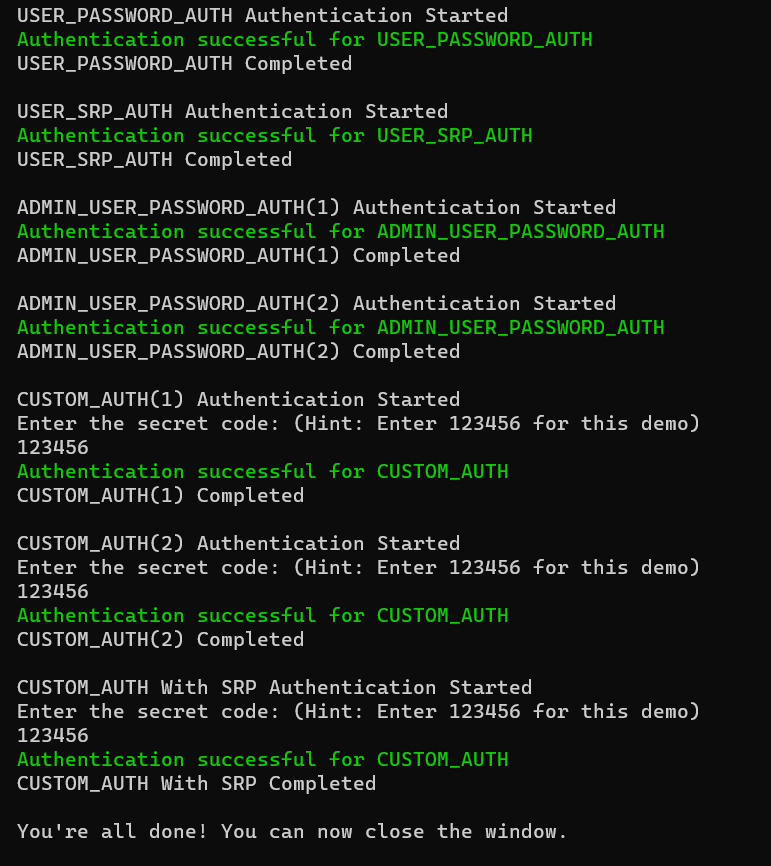

# Authentication flow examples with .NET for Amazon Cognito
This repository provides .NET samples for below authentication flows supported by Amazon Cognito.
- USER_SRP_AUTH
- USER_PASSWORD_AUTH
- ADMIN_USER_PASSWORD_AUTH
- CUSTOM_AUTH
- CUSTOM_AUTH with SRP password verification

## Authentication flows
Primarily Amazon Cognito supports the following authentication flows:
- **USER_SRP_AUTH** - Authentication flow for the Secure Remote Password (SRP) protocol. Your app collects your user's user name and password and generates an SRP that it passes to Amazon Cognito, instead of plaintext credentials.    
- **ADMIN_USER_PASSWORD_AUTH** - Admin-based user password authentication flow. Amazon Cognito receives the password in the request instead of using SRP processes to verify the password.
- **USER_PASSWORD_AUTH** - Non-SRP authentication flow; your app passes the user name and password directly to Amazon Cognito. If Amazon Cognito doesn't find the user name in the user pool and you assigned a user migration Lambda trigger to your user pool, Amazon Cognito invokes your user migration Lambda function.
- **CUSTOM_AUTH** - Customized authentication flow where you create Lambda functions that define a custom challenge and the expected response.
- **REFRESH_TOKEN_AUTH** & **REFRESH_TOKEN** - Authentication flow that generates new access and ID tokens from a valid refresh token.

## Which authentication flow to use?
You can refer the following to decide which authentication flow you need to use.

- **Client-side authentication flow** - If you have a user app using Angular, React, Vue, Flutter or client-side app.
    - USER_SRP_AUTH *(SRP)*
    - CUSTOM_AUTH
- **Server-side authentication flow** - If you don't have a user app, but instead you use a .NET, Java, Ruby, or Node.js secure backend or server-side app.
    - ADMIN_USER_PASSWORD_AUTH *(Non-SRP)*
    - USER_PASSWORD_AUTH *(Non-SRP)*
    - CUSTOM_AUTH

## How Cognito authentication flow works?
1. The authenitcation flow starts by sending `InitiateAuth` or `AdminInitiateAuth` request with a `AuthFlow` and `AuthParameters`.
2. If the `InitiateAuth` call is successful, the response includes the challenge name and challenge parameters.
3. The app then calls `RespondToAuthChallenge` with the ChallengeName and the necessary parameters in ChallengeResponses. 

> So, you initiate authentication, you receive a challenge, and you respond to the challenge with challenge parameters. This process is repeated until you obtain valid authentication tokens or the authentication fails. 

## Repository overview
This repository primarily contains a .NET solution consisting of two projects and a SAM template.
```
.
|-- src
|   `-- CognitoAuthenticationFlows.sln
|       |-- CustomAuthLambdas/CustomAuthLambdas.csproj
|       `-- TestClient/TestClient.csproj
`-- template.yaml
```

**template.yaml** - This is the SAM template for deploying a Cognito user pool as well as the three lambda functions required for CUSTOM_FLOW authentication.

**CustomAuthLambdas** - This project includes three Lambda functions that are necessary for the CUSTOM_FLOW authentication flow. To make development easier, this project makes use of the [.NET Lamdba Annotations Framework](https://aws.amazon.com/blogs/developer/net-lambda-annotations-framework/).

**TestClient** -  The main project (a console application) containing samples for all Cognito authentication flows.

## Deploy
1. Create an S3 bucket in the region where you want to deploy the solution.
	```
	aws s3 mb s3://<bucket-name>
	```
	The `mb` in the command stands for "make bucket". By default, buckets must have a globally unique name.    
	   
	> The command `dotnet lambda deploy-serverless` creates a .zip file of your code and dependencies, and uploads the file to Amazon S3.

2. To deploy this sample use the the [AWS Lambda .NET Core Global Tool](https://aws.amazon.com/blogs/developer/net-core-global-tools-for-aws/).

   1. To install the global tool execute the command.
   
        ```
        dotnet tool install -g Amazon.Lambda.Tools
        ```

    2. Then execute the following command in the root directory of this repository for deployment.
         
        ```
        dotnet lambda deploy-serverless <stack-name> --region <region> --s3-bucket <bucket-name> --template template.yaml
        ```

## Test
To test the authentication flows, follow the below steps.

1. Create a new user in recently created Cognito User Pool.
   > Replace `\` with `^` when running below multiline commands in Windows.
    ```bash
    # perform sign-up
    aws cognito-idp sign-up \
      --region <cognitoRegion> \
      --client-id <cognitoAppClientId>  \
      --username <emailAddress> \
      --password <password>
  
    # confirm sign-up  
    aws cognito-idp admin-confirm-sign-up \
      --region <cognitoRegion> \
      --user-pool-id <cognitoUserPoolId> \
      --username <emailAddress>  
    ```

2. Replace the following values in `Program.cs` of **TestClient** project.
    ```cs
	string userName = "<emailAddress>"; // use the email address of the cognito user
	string password = "<password>"; //  use the password of the cognito user
	string clientId = "<clientId>"; // get this from deployment output
	string userpoolId = "<userpoolId>"; // get this from deployment output
    ```
3. Run `TestClient` project.

4. If all goes well, the output will look like this.
   
    
  
## Clean up
Run below command to delete the CloudFormation stack.
```
dotnet lambda delete-serverless <stack-name>
```  
Run below command to delete the S3 bucket.
```
aws s3 rb s3://<bucket-name> --force  
```

## Security

See [CONTRIBUTING](CONTRIBUTING.md#security-issue-notifications) for more information.

## License

This library is licensed under the MIT-0 License. See the LICENSE file.

